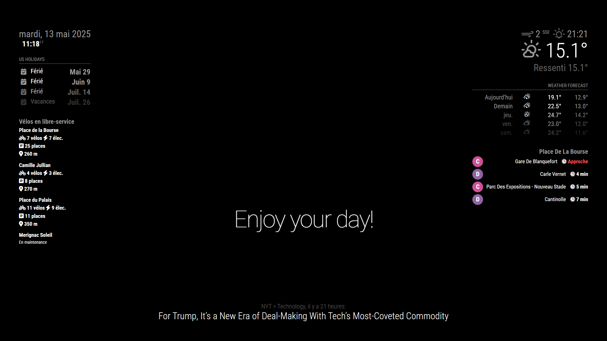

# MMM-TBM

Affiche en temps réel les bus, trams, bateaux (TBM) et les vélos en libre-service (VCUB) de Bordeaux Métropole sur MagicMirror².



## Installation

1. Dans votre terminal, rendez-vous dans le dossier des modules de MagicMirror² :

   ```bash
   cd ~/MagicMirror/modules
   ```
2. Cloner ou mettre à jour le module :

   ```bash
   # Pour cloner
   git clone https://github.com/laubezout-theo/MMM-TBM.git

   # Pour mettre à jour
   cd MMM-TBM
   git pull
   ```

## Obtention de la clé API

Pour accéder aux données de Bordeaux Métropole, vous devez obtenir une clé logicielle :

Rendez-vous sur https://data.bordeaux-metropole.fr/opendata/key

## Configuration

Ajoutez une entrée dans le tableau `modules` de votre fichier `config/config.js` :

### Transports (Bus, Tram, Bateau)

```js
{
  module: 'MMM-TBM',
  position: 'top_right', // Emplacement sur l'écran
  config: {
    station_name: 'Place De La Bourse',
    station_ids: [3880, 3881],    // IDs des arrêts TBM
    station_type: 'transport',   // Type « transport »
    key_token: 'VOTRE_CLE_API',  // Clé d'accès à l'API Bordeaux Métropole
    max_per_station: 2           // Nombre max de départs affichés par arrêt
  }
},
```

### Vélo en libre-service (VCUB)

```js
{
  module: 'MMM-TBM',
  position: 'top_left',
  config: {
    station_name: 'Vélos en libre-service',
    station_ids: [102, 42, 103, 86],  // IDs des stations VCUB
    station_distances: [             // Distances personnalisées
      { id: 102, distance: '260 m' },
      { id: 42,  distance: '270 m' },
      { id: 103, distance: '350 m' },
      { id: 86,  distance: '400 m' }
    ],
    station_type: 'citybike',         // Type « citybike »
    key_token: 'VOTRE_CLE_API'        // Clé d'accès à l'API Bordeaux Métropole
  }
},
```

## Options de configuration

| Option              | Valeurs possibles                 | Par défaut    | Description                                        |
| ------------------- | --------------------------------- | ------------- | -------------------------------------------------- |
| `station_name`      | `string`                          | —             | Nom affiché en en-tête du module                   |
| `station_ids`       | `array` de `number`               | —             | Liste des `gid` ou IDs à interroger                |
| `station_distances` | `array` d’objets `{id, distance}` | `[]`          | Distances à afficher pour chaque station VCUB      |
| `station_type`      | `'transport'` ou `'citybike'`     | `'transport'` | Choix du type de données (TBM ou VCUB)             |
| `key_token`         | `string`                          | —             | Votre clé d’API pour Bordeaux Métropole            |
| `max_per_station`   | `number`                          | `2`           | Nombre maximum de prochains départs TBM à afficher |

## Fonctionnement

* **TBM (Bus, Tram, Bateau)** : Interroge l’API SAEIV de Bordeaux Métropole pour récupérer les prochains passages par arrêt.
* **VCUB (Vélos en libre-service)** : Interroge l’API GeoJSON pour récupérer l’état des stations (vélos classiques, vélos électriques, places libres, état de service).
* Les données sont mises en cache pendant 20 secondes.
* Mise à jour automatique toutes les 30 secondes.

## Développement

* Installer les dépendances :

  ```bash
  npm install
  ```
* Lancer les vérifications :

  ```bash
  npm run lint
  npm run lint:fix
  ```

---

*Module développé pour MagicMirror² par \Théo LAUBEZOUT.*
